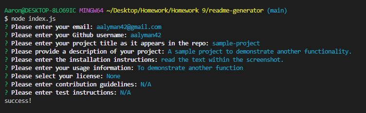
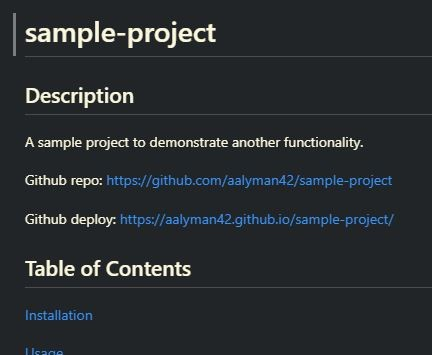

# readme-generator

## Description

An application that will create a professional readme based on command line inputs.
Starting code source: https://github.com/coding-boot-camp/potential-enigma

Github repo: https://github.com/aalyman42/readme-generator

## Table of Contents

[Installation](#installation)

[Usage](#usage)

[Credits](#credits)

[License](#license)

[Questions](#questions)

## Installation

clone the repository into a local directory

## Usage

run 'node index.js' in the terminal

## License

MIT License

## Contributions

Please contact before contributing.

## Tests

repo and deployed site are created using your input for 'project title' and 'github username'. typos will result in bad links.

## Questions

Github: https://github.com/aalyman42

email: aalyman42@gmail.com

Please reachout with any questions about the project.
